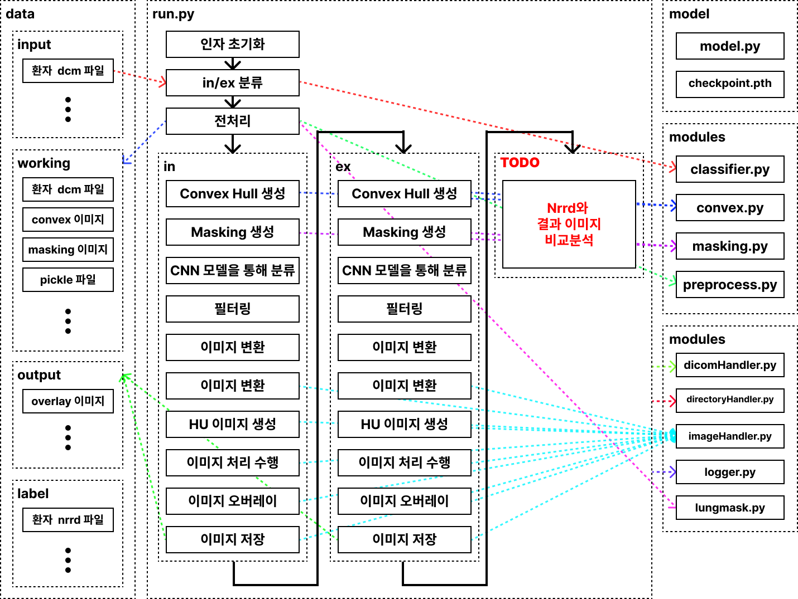

# Rib-Muscle-Segmentation

## 구조



## 디렉토리 구조

```
.
├── README.md                # 프로젝트 개요 및 설명
├── data                     # 데이터 디렉토리
│   ├── input                # 입력 데이터
│   ├── label                # 레이블 데이터
│   ├── output               # 출력 데이터
│   └── working              # 작업 중간 데이터
├── dist_run.py              # 분산 실행 스크립트
├── model                    # 모델 관련 파일
│   ├── checkpoint.pth       # 모델 체크포인트 파일
│   └── model.py             # 모델 정의 파일
├── modules                  # 모듈 디렉토리
│   ├── classifier.py        # 분류기 모듈
│   ├── convex.py            # 볼록 모듈
│   ├── masking.py           # 마스킹 모듈
│   └── preprocess.py        # 전처리 모듈
├── requirements.txt         # 필요한 패키지 목록
├── run.py                   # 실행 스크립트
└── utils                    # 유틸리티 디렉토리
    ├── dicomHandler.py      # DICOM 파일 처리 모듈
    ├── directoryHandler.py  # 디렉토리 처리 모듈
    ├── imageHandler.py      # 이미지 처리 모듈
    ├── logger.py            # 로깅 모듈
    └── lungmask.py          # 폐 마스크 모듈
```

## 환경 설정(콘다 기반)

1. 가상환경 생성:`conda create -n {환경 이름} python=3.12`

2. 가상환경 활성화: `conda activate {환경 이름}`

3. 라이브러리 설치: `pip install -r requirements.txt`

## 실행

1. `data/input` 디렉토리에 환자 DICOM 파일 추가

-   환자 번호가 `12345678`이라면, `data/input/12345678`이 되도록 위치
-   `data/input/12345678` 안에는 `dicom`파일이 위치

2. 특정 환자만 실행

-   명령어로 실행: `python run.py --patient_id={환자 번호}`

or

-   파일 수정
    `run.py`파일 26번 라인 `default`값 변경
    `parser.add_argument('--patient_id', type=str, default="{환자 ID}", help='환자 아이디(단일 환자만 분석)')`

3. 모든 환자 실행

-   명령어로 실행: `bash dist_run.sh`
-   실행 내역은 `log/{실행 일/시}/{환자 ID}.log` 로 저장됨
